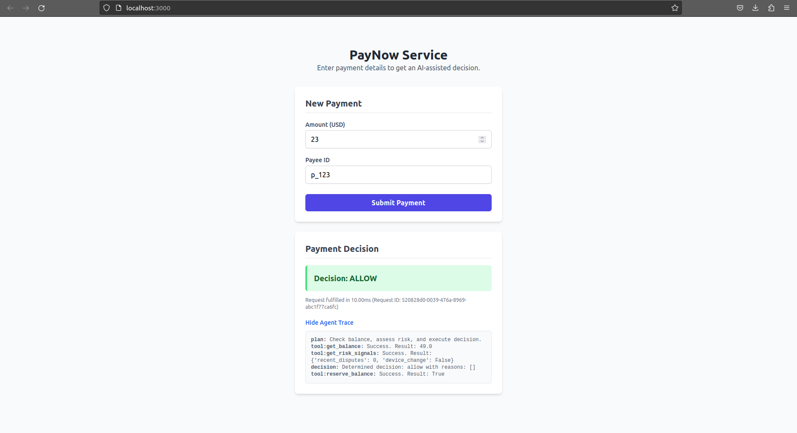

# PayNow + Agent Assist Service

This repository contains the backend service and frontend UI for the "PayNow + Agent Assist" feature, developed as part of the Zeta SDE II assessment. It is a production-minded monorepo containing a FastAPI application and a React UI.

---

## How to Run Locally

This project contains both a backend service and a frontend UI. You will need **two separate terminals** to run them concurrently.

#### **Terminal 1: Run the Backend API**
```bash
# 1. Navigate to the backend folder
cd backend

# 2. Setup virtual environment and install dependencies
python -m venv venv
source venv/bin/activate
pip install -r requirements.txt

# 3. Configure API Key in a new .env file
# (Create a .env file and add API_KEY="your-super-secret-key")
cp .env.example .env

# 4. Run the server
uvicorn src.main:app --reload
# The API will be available at [http://127.0.0.1:8000](http://127.0.0.1:8000)
```

#### **Terminal 2: Run the Frontend UI**
```bash
# 1. Navigate to the frontend folder
cd frontend

# 2. Install dependencies
npm install

# 3. IMPORTANT: Update the API key in src/App.tsx
#    Find the line with 'X-API-Key' and replace the placeholder.

# 4. Run the React app
npm start
# The UI will be available at http://localhost:3000
```

---

## Architecture Diagram

The overall service architecture involves a client (React UI) communicating with a FastAPI server. The server uses an in-memory database for state management and an agent to process business logic.

**Project Layout:**
```
/ (Git Repository Root)
├── backend/ (FastAPI Application)
│   └── src/main.py (API Endpoints, Agent Logic)
└── frontend/ (React UI)
    └── src/App.tsx (UI Components, State, API Calls)
```

---

## Key Design Decisions & Trade-offs

**What I Optimized For**: This implementation optimizes for **simplicity, correctness, and developer experience**. The code is modular and easy to understand. The monorepo structure keeps both backend and frontend code in a single, version-controlled location.

**Trade-offs Made**:
    * **In-Memory vs. Redis for State**: I chose a singleton in-memory store for rate limiting, idempotency, and balances.
        * **Pro**: Zero external dependencies, making setup trivial.
        * **Con**: State is ephemeral and not shared across multiple server instances. For a scalable production deployment, **Redis would be superior**.
    * **Agent Logic**: The agent is a simple, deterministic orchestrator class.
        * **Pro**: Predictable, fast, and easy to test.
        * **Con**: Not as flexible as a true LLM-based agent. However, the prompt explicitly allows for this deterministic approach.

---

## Feature Deep-Dive

* **Performance (p95)**:
    * The use of an in-memory database makes tool calls extremely fast.
    * Idempotency checks are a fast dictionary lookup, preventing re-computation for duplicate requests.
    * The `/metrics` endpoint provides a rough p95 latency calculation.

* **Security**:
    * **Auth**: The `/payments/decide` endpoint is protected by an `X-API-Key` header check.
    * **PII**: A custom logger automatically redacts `customerId` from all log output to prevent sensitive data leakage.
    * **CORS**: The backend is configured to only accept requests from the frontend's origin (`http://localhost:3000`).

* **Observability**:
    * **Logs**: Structured logs include a unique `requestId` for tracing a request's entire lifecycle.
    * **Metrics**: The `/metrics` endpoint provides key service health indicators like total requests, decision counts, and p95 latency.
    * **Trace**: The `agentTrace` in the API response provides a detailed log of the agent's actions for each request.

* **Agent Guardrails**:
    * **Retries**: The agent's `_call_tool_with_retry` function attempts to call each tool up to 3 times (1 initial + 2 retries), adding resilience.
    * **Fallbacks**: If a critical tool like `getBalance` fails after all retries, the agent defaults to a "block" decision to fail safely.

---

## Sample cURL Request

```bash
curl -X POST '[http://127.0.0.1:8000/payments/decide](http://127.0.0.1:8000/payments/decide)' \
--header 'accept: application/json' \
--header 'X-API-Key: your-super-secret-key' \
--header 'Idempotency-Key: some-unique-uuid-key' \
--header 'Content-Type: application/json' \
--data-raw '{
    "customerId": "c_123",
    "amount": 125.50,
    "currency": "USD",
    "payeeId": "p_789"
}'
```
